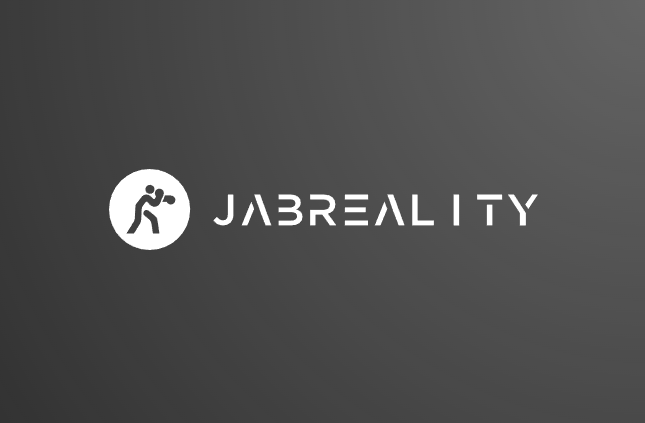

# JabReality

## Features
---
### **Welcome to the Future of fitness**
Virtual Reality fitness is an immersive way to exercise whilst also having fun doing it. Not only does this application gamify your exercise, but it also incentivizes what you do in the game. 

### **Gamification**
This game was built around the idea of gamification. Following several studies around the notion of gamification.

### **Blockchain technology**
This game utilizes the [thirdweb](https://thirdweb.com/) framework to build a the game within on the blockchain. Thus, this game is able to incentivize your progress in Virtual Reality through NFT's and eventually tokens. You will be required to connect a web3 wallet in order to play the game.

### **WebGL VR**
This game will be accessible through your browser simply by navigating to the JabReality Website. Through there, you are able to play the game. This allows for the game to be played on any VR platform. However, it is advised that you should use a [6dof headset](https://en.wikipedia.org/wiki/Six_degrees_of_freedom).

---
## How To play?